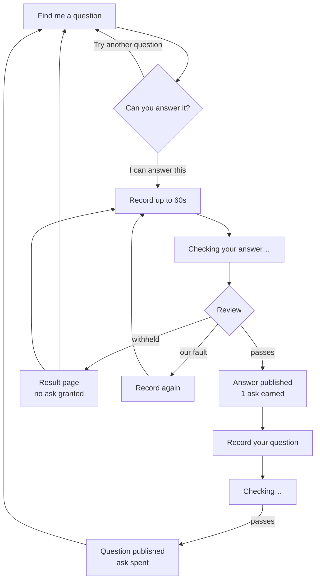
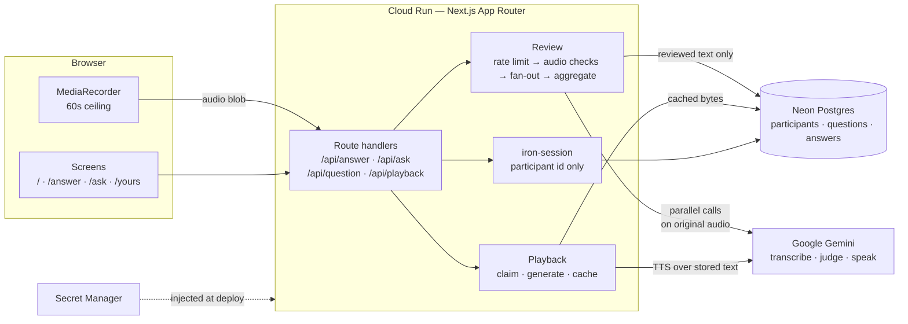

# Happen to Have?

**Answer one. Ask one.**

[](https://github.com/anchildress1/happen-to-have/actions/workflows/ci.yml) [](https://github.com/anchildress1/happen-to-have/actions/workflows/codeql.yml) [](https://sonarcloud.io/dashboard?id=anchildress1_happen-to-have) [](https://conventionalcommits.org) [](LICENSE)

A human advice exchange. Every question and every answer comes from a person speaking into a
microphone. Before you can ask for help, you give some.

🔗 **Live:** <https://happen-to-have-288489184837.us-east1.run.app>

---

## Table of contents

- [About](#about)
- [How the loop works](#how-the-loop-works)
- [Features](#features)
- [Tech stack](#tech-stack)
- [Architecture](#architecture)
- [Project structure](#project-structure)
- [Getting started](#getting-started)
- [Configuration](#configuration)
- [Security](#security)
- [How to contribute](#how-to-contribute)
- [What's next](#whats-next)
- [License](#license)
- [Acknowledgements](#acknowledgements)
- [Author](#author)

---

## About

Most advice apps make you a consumer. This one makes you a neighbor first.

You arrive, you're handed somebody's question, and you talk for up to a minute. Automated review
checks that you actually answered, took nobody's privacy with you, and aren't in trouble
yourself. If it passes, your answer publishes and you've earned exactly one question of your own.

Spend it, and you're back to needing an answer.

**What it is not:** a chatbot, a marketplace, an expert network, a therapy service, or a feed.
Nothing on this platform generates advice. The review transcribes, translates, redacts, and
decides — it never writes.

### Where the name comes from

"Happen to have" is Appalachian, and so is the person who built this. The value system comes from
a childhood church group called the Busy Bees, who cooked for neighbors and helped whoever needed
it: bring what you have, receive what you need, and don't split people permanently into helpers
and helped.

That's the origin story — not a theme, not a dialect, and not a restriction on who can use it.

---

## How the loop works



Three rules the diagram is enforcing:

- **The ask is granted by the review, not by the recording.** Finishing a recording earns nothing.
- **Failure costs nothing.** A withheld answer applies no penalty. A broken check retries independently; exhausted failures offer a fresh recording.
- **Asks don't stack.** One unspent ask, maximum, forever.

---

## Features

| Feature | What it does |
| - | - |
| **Anonymous participation** | No account, no email, no password. A session cookie is the whole identity. |
| **Seeded question pool** | Every arrival is handed a real question someone is waiting on. Skipping is free and unlimited. |
| **60-second voice answers** | Recorded in the browser, capped at a minute, submitted as audio — never typed. |
| **Automated review** | Parallel per-signal checks (relevance, content, illegality, crisis) fan out on the original audio and aggregate into one decision. |
| **Crisis routing** | A recording that suggests the speaker is in danger is routed to help rather than published or punished. |
| **The reciprocity gate** | A passing answer grants exactly one ask. Asking spends it. Asks never stack. |
| **`Yours` history** | Your published questions and answers, plus the responses your questions received. |
| **Generated playback** | Published answers are voiced on demand, once, and cached — text-to-speech over the reviewed transcript, never over the original recording. |
| **Rate limiting** | Submissions are bounded per participant, before any provider call, so a limited submission costs nothing. |
| **Transient audio** | Original recordings are released on every exit path from the review. Only reviewed text is stored. |

---

## Tech stack

Pinned by the constitution; exact versions are settled per-spec during planning.

| Layer | Choice |
| - | - |
| Runtime | Node.js 24 LTS, ESM only |
| Framework | Next.js 16 App Router, React 19, TypeScript strict |
| Package manager | pnpm (via corepack) |
| Database | Neon serverless PostgreSQL, branch per git branch |
| Migrations | `node-pg-migrate`, plain SQL |
| Speech, review, playback | Google Gemini — one provider, end to end |
| Sessions | `iron-session`, encrypted cookie |
| Validation | Zod |
| Lint / format | Biome |
| Tests | Vitest (unit + integration on PGlite), Playwright (e2e) |
| Hooks | Lefthook, commitlint, gitleaks |
| Hosting | Cloud Run (`us-east1`), Artifact Registry, Secret Manager |

Deliberately absent: ElevenLabs in any role, and any framing of the pipeline as an agent.

---

## Architecture



Two invariants the diagram is enforcing:

- **Audio never reaches the database.** The review is the only component that holds a recording, and it releases it on every exit path. Storage sees reviewed text.
- **Eligibility is never carried in the cookie.** The session holds a participant id and nothing else; every ask decision re-reads the database.

---

## Project structure

```text
.
├── app/                      # Next.js App Router
│   ├── page.tsx              # Landing + question pool
│   ├── answer/record/        # Answer recording flow
│   ├── ask/                  # Question recording flow (spends the ask)
│   ├── yours/                # History and responses
│   └── api/                  # answer · ask · question · playback route handlers
├── src/
│   ├── review/               # Rate limit, audio checks, per-signal prompts, aggregation
│   ├── playback/             # Lazy TTS, voice selection, WAV assembly
│   ├── db/                   # Neon client, queries, playback lock
│   ├── session/              # iron-session config and server helpers
│   ├── schema/               # Row types
│   ├── ui/                   # Design-system components and tokens
│   └── copy.ts               # Every participant-facing string, in one file
├── migrations/               # Plain-SQL node-pg-migrate migrations
├── seed/                     # Idempotent question-pool seeding
├── tests/                    # unit · integration (PGlite) · e2e (Playwright)
├── specs/                    # Five specs — start at specs/README.md
├── docs/                     # Human-facing documentation
├── .specify/memory/constitution.md   # Ratified governance — the binding rules
├── Dockerfile                # Multi-stage standalone build
├── deploy.sh                 # Build, push, IAM, deploy to Cloud Run
└── Makefile                  # `make help` lists every target
```

Start at [`specs/README.md`](specs/README.md). It carries the dependency graph and explains which
spec owns which rule.

The [constitution](.specify/memory/constitution.md) outranks everything else in this repo. If a
spec and the constitution disagree, the constitution wins and the spec is wrong.

---

## Getting started

### Prerequisites

- **Node.js 24** (`.nvmrc` pins it) — pnpm arrives via `corepack enable`
- **[Neon CLI](https://neon.com/docs/reference/neon-cli)**, authenticated — every git branch gets its own copy-on-write database
- **[gitleaks](https://github.com/gitleaks/gitleaks#installing)** — the pre-commit secret scan requires it
- A **Gemini API key** for anything that touches review or playback

### Setup

```bash
git clone https://github.com/anchildress1/happen-to-have.git
cd happen-to-have

corepack enable
make install                 # pnpm install --frozen-lockfile

cp .env.example .env         # then set SESSION_SECRET (see Configuration)
make db-up                   # creates this branch's Neon database, writes DATABASE_URL
make migrate                 # apply migrations
make seed                    # upsert the question pool (idempotent)

make dev                     # http://localhost:3000
```

### Everyday targets

```bash
make ai-checks    # format-check · lint · typecheck · test · secret-scan — stops on first failure
make test         # unit + integration (PGlite, no network)
make e2e          # Playwright against a throwaway Neon branch, torn down on exit
make build        # production Next.js build
make help         # everything else
```

`make e2e` never runs against the branch in `.env` — every browser context is a new participant,
so a suite pointed at a shared database fills it with hundreds of rows you then demo against.

---

## Configuration

Every value below is read from the environment. Locally they live in `.env` (gitignored); in
production they live in Secret Manager as `${HTH_SECRET_PREFIX}_<VAR>` and are injected at deploy
time by `deploy.sh`. Nothing is hardcoded and nothing is logged.

| Variable | Required | What it does |
| - | - | - |
| `SESSION_SECRET` | **yes** | iron-session encryption key. Minimum 32 characters — the app refuses to boot without it. Generate with `openssl rand -base64 32`. |
| `DATABASE_URL` | **yes** | Neon pooled connection string. Written by `make db-up`. |
| `DATABASE_URL_UNPOOLED` | for migrations | Direct endpoint. The pooled endpoint is PgBouncer in transaction mode and cannot hold the advisory lock migrations take. |
| `GEMINI_API_KEY` | for review/playback | Google Gemini key. Bound in production only when the secret exists. |
| `NEON_BRANCH` | no | Informational — which Neon branch `neon checkout` last selected. |
| `HTH_RATE_LIMIT_MAX` | no | Submissions allowed per window. Defaults live in code, so a deployment that sets nothing still has a limit. |
| `HTH_RATE_LIMIT_WINDOW_SECONDS` | no | Length of that window. |

### Deploying

```bash
./deploy.sh                                   # uses the default gcloud project
PROJECT_ID=my-project ./deploy.sh             # or override any identifier
```

`deploy.sh` enables the required APIs, creates the Artifact Registry repository and its retention
policy, grants the Cloud Run runtime read access to each bound secret, builds, and deploys. Every
identifier is an overridable environment variable, so a one-off never requires editing the script.

---

## Security

- **No accounts, no credentials.** Identity is an encrypted, `httpOnly`, `sameSite=lax` session
  cookie carrying a participant UUID and nothing else. There is no password to leak.
- **No fallback secret.** A missing or short `SESSION_SECRET` fails boot rather than defaulting —
  a default secret is a forgeable session for every deployment that forgot to set one.
- **Eligibility is never client-side.** The cookie carries no ask flag and no counts. Every
  decision re-reads the database.
- **Secrets are bound, never set.** Cloud Run reads them from Secret Manager; `--set-env-vars`
  would put `DATABASE_URL`'s password in the service description and the deploy logs.
- **Least-privilege IAM.** `secretAccessor` is granted per secret, not project-wide, so this
  service cannot read another service's secrets.
- **Audio is transient.** Original recordings are released on every exit path from the review.
  Only reviewed text is persisted, and redaction happens before storage.
- **Scanned continuously.** CodeQL and SonarCloud run on `main`; gitleaks runs pre-commit.

Found something? Open a [security advisory](https://github.com/anchildress1/happen-to-have/security/advisories/new)
rather than a public issue.

---

## How to contribute

- **Branch and PR always.** Nothing lands directly on `main`.
- **[Conventional Commits](https://www.conventionalcommits.org/) v1.0.0**, enforced by commitlint
  in a `commit-msg` hook. Commits are GPG-signed and carry an AI-attribution trailer.
- **Atomic commits.** One logical change each.
- **`make ai-checks` must pass** before you open a PR. CI runs the same gates.
- **The constitution outranks your PR.** If a change conflicts with
  [`.specify/memory/constitution.md`](.specify/memory/constitution.md), the constitution wins.
- **Specs come first.** Behaviour changes belong in the owning spec under `specs/` before they
  belong in code.

---

## What's next

Built against a two-day window for the DEV Weekend Challenge: Generosity Edition. All five specs
are implemented and deployed.

- [x] **Kill spike** — guardrail checks measured; the provider's own filter proved insufficient ([results](docs/spike-002-guardrails.md))
- [x] **001** — participant identity, landing, seeded pool, selection, skip
- [x] **002** — the review: guardrails, crisis routing, retry, audio lifecycle
- [x] **003** — answer recording and the ask unlock
- [x] **004** — question recording and the ask spend
- [x] **005** — `Yours` history and generated playback
- [x] Deploy to Cloud Run
- [ ] Demo on real phones and write the submission
- [ ] Calibrate the rate limit against a complete answer-then-ask cycle (currently a guess, not a measurement)
- [ ] Durable identity, so clearing cookies stops resetting your state

Known and accepted for the weekend: identity is session-scoped, so clearing cookies resets your
state. The reciprocity gate is soft by design during the challenge. Only published contributions
are stored in `Yours`; unpublished attempts are discarded. Every Withheld reason, including
crisis, permits a fresh recording.

---

## License

[Polyform Shield 1.0.0](LICENSE).

Read it, run it, fork it, learn from it, break it on purpose. The one thing you can't do is turn
it into a product that competes with this one. Source-available is not MIT — if you're planning
something commercial, read the actual license before you get attached.

---

## Acknowledgements

- The **Busy Bees**, a childhood church group in Appalachia, for the value system the whole
  product is built on: bring what you have, receive what you need.
- **[DEV](https://dev.to)** for the Weekend Challenge: Generosity Edition, which set the two-day
  window this was built in.
- **[Spec Kit](https://github.com/github/spec-kit)** for the spec-and-constitution workflow under
  `.specify/`.
- **Neon**, **Google Gemini**, and **Google Cloud Run** for the infrastructure this runs on.

---

## Author

**Ashley Childress** — [@anchildress1](https://github.com/anchildress1)
