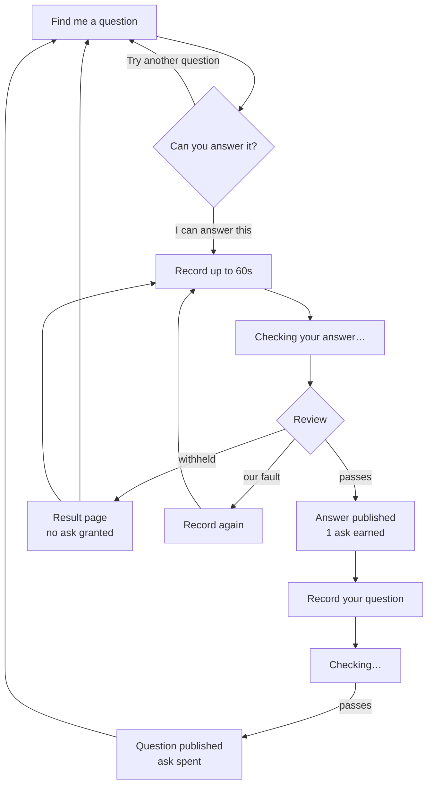

# Happen to Have?

**Answer one. Ask one.**

A human advice exchange. Every question and every answer comes from a person speaking into a
microphone. Before you can ask for help, you give some.

> **Status:** specification stage. No application code yet — see [What's Next](#whats-next).

---

## About

Most advice apps make you a consumer. This one makes you a neighbor first.

You arrive, you're handed somebody's question, and you talk for up to a minute. Automated review
checks that you actually answered, took nobody's privacy with you, and aren't in trouble
yourself. If it passes, your answer publishes and you've earned exactly one question of your own.

Spend it, and you're back to needing an answer.

**What it is not:** a chatbot, a marketplace, an expert network, a therapy service, or a feed.
Nothing on this platform generates advice. The review transcribes, translates, redacts, and
decides — it never writes.

### Where the name comes from

"Happen to have" is Appalachian, and so is the person who built this. The value system comes from
a childhood church group called the Busy Bees, who cooked for neighbors and helped whoever needed
it: bring what you have, receive what you need, and don't split people permanently into helpers
and helped.

That's the origin story — not a theme, not a dialect, and not a restriction on who can use it.

---

## How the loop works



Three rules the diagram is enforcing:

- **The ask is granted by the review, not by the recording.** Finishing a recording earns nothing.
- **Failure costs nothing.** A withheld answer applies no penalty. A broken check retries independently; exhausted failures offer a fresh recording.
- **Asks don't stack.** One unspent ask, maximum, forever.

---

## Project structure

```text
.
├── .specify/
│   ├── memory/constitution.md   # Ratified governance — the binding rules
│   └── templates/               # Spec Kit templates
├── specs/
│   ├── README.md                # Build order, dependency graph, coverage map
│   ├── 001-participant-and-pool/    # Identity, landing, pool, selection, skip
│   ├── 002-contribution-review/     # The review, guardrails, crisis routing, audio lifecycle
│   ├── 003-answer-and-unlock/       # Answer recording — grants the ask
│   ├── 004-ask-one/                 # Question recording — spends the ask
│   └── 005-yours-and-playback/      # History, responses, generated playback
└── docs/                        # Human-facing documentation
```

Start at [`specs/README.md`](specs/README.md). It carries the dependency graph and explains which
spec owns which rule.

The [constitution](.specify/memory/constitution.md) outranks everything else in this repo. If a
spec and the constitution disagree, the constitution wins and the spec is wrong.

---

## Tech stack

Pinned by the constitution; exact versions are settled per-spec during planning.

| Layer | Choice |
| - | - |
| Runtime | Node.js 24 LTS, ESM only |
| Framework | Next.js App Router, TypeScript strict |
| Package manager | pnpm |
| Database | Managed PostgreSQL |
| Transient audio | Cloud Storage, no public access, lifecycle deletion |
| Speech, review, playback | Google Gemini — one provider, end to end |
| Hosting | Cloud Run (`us-east1`), Artifact Registry, Secret Manager |

Deliberately absent: ElevenLabs in any role, and any framing of the pipeline as an agent.

---

## What's next

Built against a two-day window for the DEV Weekend Challenge: Generosity Edition.

- [x] **Kill spike** — guardrail checks measured; the provider's own filter proved insufficient ([results](docs/spike-002-guardrails.md)). Cost and 60-second latency still open.
- [ ] **001** — participant identity, landing, seeded pool, selection, skip
- [ ] **002** — the review: guardrails, crisis routing, retry, audio lifecycle
- [ ] **003** — answer recording and the ask unlock
- [ ] **004** — question recording and the ask spend
- [ ] **005** — `Yours` history and generated playback
- [ ] Deploy, demo on real phones, write the submission

Only published contributions are stored in `Yours`; unpublished attempts are discarded when the
submission ends or the participant leaves. Every Withheld reason, including crisis, permits a
fresh recording. Ashley will author the seed pool; seed content remains TBD.

Known and accepted for the weekend: identity is session-scoped, so clearing cookies resets your
state. The reciprocity gate is soft by design during the challenge.

---

## License

[Polyform Shield 1.0.0](LICENSE).

Read it, run it, fork it, learn from it, break it on purpose. The one thing you can't do is turn
it into a product that competes with this one. Source-available is not MIT — if you're planning
something commercial, read the actual license before you get attached.

---

## Author

**Ashley Childress** — [@anchildress1](https://github.com/anchildress1)
