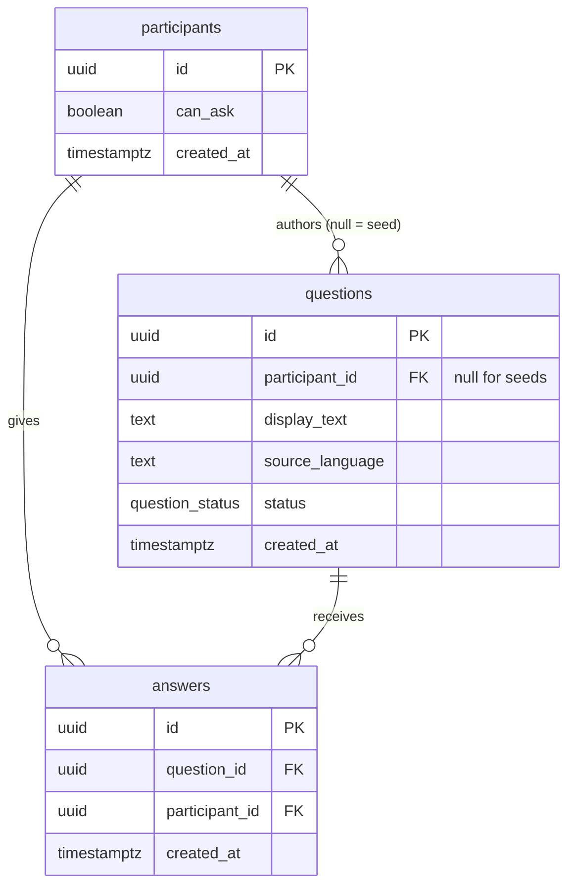

# Data Model: Participant Identity and Question Pool

**Feature**: 001-participant-and-pool | **Date**: 2026-09-04

Only the columns this feature reads or writes are created here. Specs 002–005 add their own in
their own migrations. The deferred-columns table at the bottom records who owns what, so nothing
gets lost.

---

## Entities

### `participants`

One anonymous, session-scoped person.

| Column | Type | Constraints | Purpose |
| - | - | - | - |
| `id` | `uuid` | PK, default `gen_random_uuid()` | Identity. Carried in the session cookie. |
| `can_ask` | `boolean` | `NOT NULL DEFAULT false` | Ask eligibility. **Read-only in this feature.** Written by 003 (grant) and 004 (consume). |
| `created_at` | `timestamptz` | `NOT NULL DEFAULT now()` | Audit. |

**Rules**
- Created lazily on first interaction (FR-001). No signup path exists (FR-002).
- No name, username, profile, or credential column exists — the schema itself enforces FR-003.
- `can_ask` is never written in 001. Skipping must not change it (FR-022), and this feature has
  no other path that could.

---

### `questions`

A published question available to be answered.

| Column | Type | Constraints | Purpose |
| - | - | - | - |
| `id` | `uuid` | PK, default `gen_random_uuid()` | Identity. |
| `participant_id` | `uuid` | `NULL`, FK → `participants(id)` | Author. `NULL` marks a seeded question. |
| `display_text` | `text` | `NOT NULL`, length 1–2000 | The question as shown (FR-013). |
| `source_language` | `text` | `NOT NULL DEFAULT 'en'` | Detected source language. Always `'en'` for seeds. |
| `status` | `question_status` | `NOT NULL DEFAULT 'open'` | `'open'` or `'closed'`. Closed is excluded from routing (FR-017). |
| `created_at` | `timestamptz` | `NOT NULL DEFAULT now()` | Audit. |

```sql
CREATE TYPE question_status AS ENUM ('open', 'closed');
```

**Rules**
- `participant_id IS NULL` identifies a seeded question. This is how FR-028 holds: seeds belong to
  no participant, so no personal history view can ever surface them.
- Seeds are otherwise ordinary rows (FR-027) — same table, same selection path, same closure.
- `status` is only ever written by 004, which owns the closure rule. This feature reads it.
- Unanswered questions never expire (FR-019). There is deliberately no `expires_at`.

---

### `answers`

Not written by this feature. Created here because selection cannot work without it: FR-016 needs
"has this participant already answered this question," and FR-018 needs a published-answer count.

| Column | Type | Constraints | Purpose |
| - | - | - | - |
| `id` | `uuid` | PK, default `gen_random_uuid()` | Identity. |
| `question_id` | `uuid` | `NOT NULL`, FK → `questions(id)` | Which question. |
| `participant_id` | `uuid` | `NOT NULL`, FK → `participants(id)` | Who answered. |
| `created_at` | `timestamptz` | `NOT NULL DEFAULT now()` | Audit. |

**Rules**

- An answer row exists only after publication; withheld, failed, or abandoned attempts leave no row.
- Selection excludes a question when any answer row exists for the participant/question pair.
- A unique constraint on `(participant_id, question_id)` prevents two concurrent published answers
  by the same participant to the same question.
- Answer count is the number of rows; no processing or failure enum is needed.

---

## Relationships



---

## Indexes

| Index | On | Why |
| --- | --- | --- |
| `questions_status_idx` | `questions (status)` | Exclude closed questions. |
| `answers_participant_question_key` | UNIQUE `answers (participant_id, question_id)` | One published answer per participant/question; eligibility lookup. |
| `answers_question_idx` | `answers (question_id)` | Count published answers. |

## Selection query

Start each pass with one ordered eligible list:

```sql
SELECT q.id, q.display_text, COUNT(a.id) AS published_answers
FROM questions q
LEFT JOIN answers a ON a.question_id = q.id
WHERE q.status = 'open'
  AND q.participant_id IS DISTINCT FROM $1
  AND NOT EXISTS (
    SELECT 1 FROM answers x
    WHERE x.question_id = q.id AND x.participant_id = $1
  )
GROUP BY q.id
ORDER BY published_answers ASC, q.created_at ASC, q.id ASC;
```

`$1` is the authenticated participant id. The handler returns the first question and the ordered
ids, not all question texts. The current tab keeps the ids and pointer in memory.

Skipping increments the pointer; it never rearranges ids or adds exclusions. Before returning
the selected id's text, the server checks open status, authorship, and absence of a published
answer again. If stale, advance to the next id. On exhaustion, refresh the ordered list and wrap.
If the refreshed first item is the one just skipped and an alternative exists, advance once.
A singleton stays visible with the single-question helper; only zero eligible rows means empty.

Counts are fixed for the current pass and refreshed on the next pass. Strict least-answered
first is intentional; two participants can receive the same question. Ties are deterministic.

## State transitions

Nothing in this feature transitions state. Recorded for the specs that do:

```text
questions.status:  open ──► closed        (004, at 3 published answers from 3 distinct participants)
answers:           absent ──► published row          (003, only after all checks pass)
participants.can_ask:  false ──► true     (003, on a passing answer)
                       true  ──► false    (004, on question creation)
```

---

## Validation

Every row crossing into application code is parsed with Zod 4.5.4 before use (research D5).
`display_text` is validated at 1–2000 characters on read as well as write — a driver returning an
unexpected shape must fail loudly rather than render an empty card.

**Publication**: pending, Withheld, failed, and abandoned submissions never create question or
answer rows. 003/004 insert the published row and grant/consume the ask in the same transaction.
Published rows carry a participant-scoped submission id for idempotent replay after a lost
response; it is publication metadata, not a retained attempt. A replay returns the committed
result without a second grant or consumption.

---

## Columns deliberately deferred

The handoff lists a fuller schema. These columns are **not** created here. Creating unused columns
to match a document is speculative work, and Principle VI forbids "it might be useful later."

| Table | Deferred columns | Owning spec |
| --- | --- | --- |
| `questions` | `duration_seconds`, `submission_id` | 004 |
| `questions` | `generated_audio_storage_key`, `audio_voice_id` | 005 |
| `answers` | `duration_seconds`, `submission_id`, `display_text`, `source_language`, `emotion` | 003 |
| `answers` | `generated_audio_storage_key`, `audio_voice_id` | 005 |

Review state, errors, retry counters, and source-audio keys are request-scoped and never stored
on contribution rows.

Each owning spec adds its columns in its own migration. Only the question routing enum exists;
unpublished submissions have no database state.
