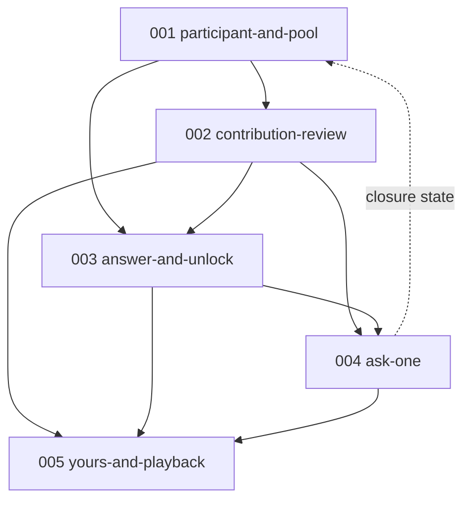

# Specs — Happen to Have?

Five specs. Build in numeric order; each depends only on lower numbers.

| # | Spec | Owns |
|---|------|------|
| 001 | [participant-and-pool](001-participant-and-pool/spec.md) | Anonymous identity, landing, seeded pool, selection, skip, empty states |
| 002 | [contribution-review](002-contribution-review/spec.md) | The four checks, aggregate decision, shared result page, crisis routing, retry, audio lifecycle, rate limiting |
| 003 | [answer-and-unlock](003-answer-and-unlock/spec.md) | Answer recording, 60s ceiling, checking state, **granting** one ask |
| 004 | [ask-one](004-ask-one/spec.md) | Question recording, publication, **consuming** the ask, question lifecycle and closure |
| 005 | [yours-and-playback](005-yours-and-playback/spec.md) | `Yours` history, flat responses, lazy generated playback |

## Dependency graph

## Ownership boundaries

Rules that touch more than one spec are defined once and referenced elsewhere:

- **Ask granting** → 003. **Ask consumption** → 004. Neither restates the other.
- **Question closure rule** → 004. 001 honors the resulting closed state.
- **Review, result page, crisis routing, audio deletion** → 002. 003 and 004 consume the decision.
- **Recording behavior** → 003. 004 reuses it rather than respecifying it.
- **Answer eligibility** appears twice on purpose: 001 controls what is *shown*, 003 controls what is *accepted*. The server-side refusal in 003 is the one that matters.
- **Original-recording prohibition** appears twice on purpose: 002 forbids retention, 005 forbids offering it in the interface.

## Handoff validation coverage

All 22 required validation cases from the handoff map to at least one spec:

| Case | Spec |
|------|------|
| Recording stops at 60s | 003, 004 |
| Short answer can qualify | 003 |
| Irrelevant answer does not unlock | 002, 003 |
| Silence does not unlock | 002 |
| Unintelligible does not unlock | 002 |
| Guardrail failure does not unlock | 003 |
| Passing answer unlocks exactly one | 003 |
| Second question needs another answer | 004 |
| Infrastructure failure is retryable | 002 |
| Non-English produces valid text | 002 |
| Identifying info removed | 002 |
| Crisis withheld and routed | 002 |
| Illegal withheld with distinct text | 002 |
| Cannot answer own question | 001, 003 |
| No repeat question after answering | 001, 003 |
| Multiple answers, no ranking | 005 |
| Unanswered questions stay open | 004 |
| Closes after 3 answers from 3 participants | 004 |
| Original audio not publicly reachable | 002 |
| Playback does not block publication | 005 |
| Skipping never grants an ask | 001 |
| Rate limiting covers a full cycle | 002 |

## Weekend build order

The initial kill spike is prerequisite to **002** and gates the whole plan. Run it first.

Day 1 → 001, 002, 003. Day 2 → 004, 005, deploy, demo.
